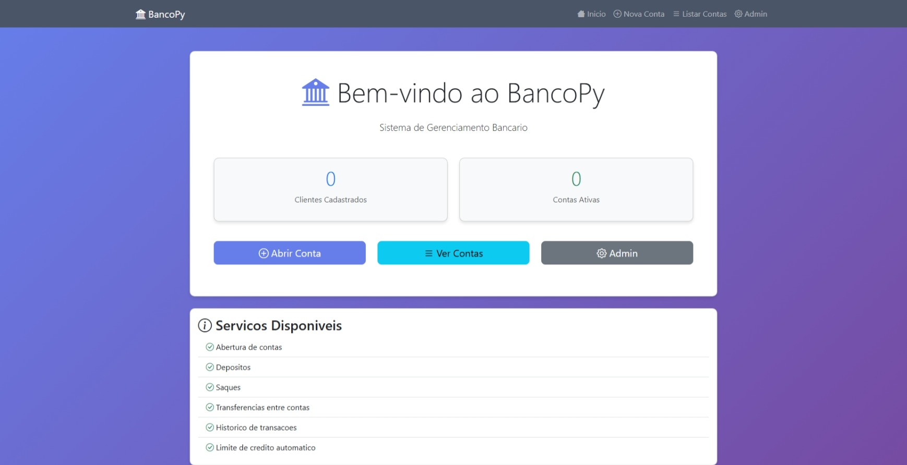

<div align="center">

# 🏦 BancoPy

### Sistema Bancario Web com Django

[](https://www.python.org/)
[](https://www.djangoproject.com/)
[](https://getbootstrap.com/)
[]()

Uma aplicacao web moderna e completa para gerenciamento bancario, desenvolvida com Django e Bootstrap 5.

[Demonstracao](#-demonstracao) • [Funcionalidades](#-funcionalidades) • [Instalacao](#-instalacao) • [Uso](#-como-usar) • [Tecnologias](#-tecnologias)

</div>

---

## 📸 Demonstracao

<div align="center">

### Interface Principal


### Sistema completo com PIX, Depositos, Saques e Transferencias

</div>

---

## ✨ Funcionalidades

### 🎯 Principais Recursos

- ✅ **Gestao de Clientes** - Cadastro completo com validacao de dados
- 💰 **Contas Bancarias** - Criacao automatica com limite de credito (R$ 100,00)
- 📥 **Depositos** - Suporte a formato brasileiro (virgula e ponto)
- 📤 **Saques** - Utilizacao automatica do limite quando necessario
- 🔄 **Transferencias** - Entre contas com validacao de saldo
- 📊 **Historico** - Registro completo de todas transacoes
- 🔐 **Django Admin** - Interface administrativa robusta
- 🎨 **UI/UX Moderna** - Design responsivo com Bootstrap 5

### 💡 Diferenciais

- 🌐 Interface web intuitiva e responsiva
- 🇧🇷 Formato brasileiro de valores monetarios
- 🔒 Validacoes robustas em todas operacoes
- 📱 Totalmente responsivo (mobile-first)
- ⚡ Feedback instantaneo ao usuario
- 🎯 Sistema de mensagens contextual

---

## 🚀 Instalacao

### Prerequisitos

- Python 3.13+
- pip (gerenciador de pacotes Python)
- Git

### Passo a Passo

1️⃣ **Clone o repositorio**
```bash
git clone https://github.com/SEU_USUARIO/BancoPy.git
cd BancoPy
```

2️⃣ **Crie um ambiente virtual**
```bash
# Windows
python -m venv venv
venv\Scripts\activate

# Linux/Mac
python3 -m venv venv
source venv/bin/activate
```

3️⃣ **Instale as dependencias**
```bash
pip install -r requirements.txt
```

4️⃣ **Configure o banco de dados**
```bash
python manage.py migrate
```

5️⃣ **Crie um superusuario**
```bash
python manage.py createsuperuser
```

6️⃣ **Inicie o servidor**
```bash
python manage.py runserver
```

7️⃣ **Acesse a aplicacao**
- Interface: http://localhost:8888
- Admin: http://localhost:8888/admin

---

## 📖 Como Usar

### Interface Web

#### 1. Criar uma Conta
```
Home → Abrir Conta → Preencher dados → Criar
```
A conta sera criada com:
- Saldo inicial: R$ 0,00
- Limite de credito: R$ 100,00
- Numero gerado automaticamente

#### 2. Fazer Deposito
```
Conta → Deposito → Informar valor (ex: 1000,50) → Confirmar
```

#### 3. Realizar Saque
```
Conta → Saque → Informar valor → Confirmar
```
💡 **Dica**: Se o saldo for insuficiente, o sistema usa automaticamente o limite disponivel.

#### 4. Transferir entre Contas
```
Conta Origem → Transferir → Numero da conta destino → Valor → Confirmar
```

#### 5. Visualizar Historico
```
Detalhes da Conta → Secao "Ultimas Transacoes"
```

### Django Admin

Acesse funcionalidades administrativas avancadas:

- 📊 Dashboard com estatisticas
- 🔍 Busca e filtragem avancada
- 📝 CRUD completo de clientes e contas
- 📈 Relatorios de transacoes
- 🎯 Gestao de usuarios do sistema

---

## 🛠 Tecnologias

### Backend
- **Django 5.1.1** - Framework web Python
- **Python 3.13** - Linguagem de programacao
- **SQLite** - Banco de dados

### Frontend
- **Bootstrap 5.3** - Framework CSS
- **Bootstrap Icons** - Biblioteca de icones
- **HTML5/CSS3** - Markup e estilizacao
- **JavaScript** - Interatividade

### Ferramentas
- **Git** - Controle de versao
- **pip** - Gerenciador de pacotes Python

---

## 📁 Estrutura do Projeto

```
BancoPy/
├── 📂 bancoprojeto/          # Configuracoes Django
│   ├── settings.py           # Configuracoes do projeto
│   ├── urls.py               # URLs principais
│   └── wsgi.py               # Configuracao WSGI
│
├── 📂 contas/                # App principal
│   ├── 📂 migrations/        # Migracoes do banco
│   ├── 📂 templates/         # Templates HTML
│   │   └── 📂 contas/
│   │       ├── base.html
│   │       ├── home.html
│   │       ├── criar_conta.html
│   │       ├── conta_list.html
│   │       ├── conta_detail.html
│   │       ├── deposito.html
│   │       ├── saque.html
│   │       └── transferencia.html
│   ├── models.py             # Models (Cliente, Conta, Transacao)
│   ├── views.py              # Views e logica de negocio
│   ├── forms.py              # Formularios Django
│   ├── admin.py              # Configuracao do Admin
│   └── urls.py               # URLs do app
│
├── 📂 models/                # Models legados (CLI)
├── 📂 utils/                 # Utilitarios
├── banco.py                  # Script CLI original
├── manage.py                 # Gerenciador Django
├── requirements.txt          # Dependencias
├── .gitignore               # Arquivos ignorados pelo Git
├── README.md                # Este arquivo
└── QUICKSTART.md            # Guia rapido de inicio
```

---

## 🎯 Models e Regras de Negocio

### Cliente
```python
- codigo: AutoField (PK)
- nome: CharField(200)
- email: EmailField (unique)
- cpf: CharField(14, unique)
- data_nascimento: DateField
- data_cadastro: DateTimeField (auto)
```

### Conta
```python
- numero: AutoField (PK)
- cliente: OneToOneField(Cliente)
- saldo: DecimalField (default: 0.00)
- limite: DecimalField (default: 100.00)
- data_abertura: DateTimeField (auto)
```

### Transacao
```python
- conta: ForeignKey(Conta)
- tipo: CharField (D/S/T)
- valor: DecimalField
- conta_destino: ForeignKey(Conta, optional)
- data_hora: DateTimeField (auto)
- descricao: TextField
```

### Regras de Negocio

1. **Saldo Total** = Saldo + Limite
2. **Saques/Transferencias**: Usa limite automaticamente se saldo insuficiente
3. **Depositos**: Creditam diretamente no saldo
4. **Validacoes**: Todos valores devem ser positivos
5. **Formato**: Aceita virgula (1.000,50) ou ponto (1000.50)

---

## 🔧 Comandos Uteis

### Desenvolvimento
```bash
# Iniciar servidor
python manage.py runserver

# Iniciar em porta especifica
python manage.py runserver 8080

# Criar migracoes
python manage.py makemigrations

# Aplicar migracoes
python manage.py migrate

# Criar superusuario
python manage.py createsuperuser

# Entrar no shell Django
python manage.py shell

# Coletar arquivos estaticos
python manage.py collectstatic
```

### Banco de Dados
```bash
# Acessar banco SQLite
python manage.py dbshell

# Limpar banco (CUIDADO!)
rm db.sqlite3
python manage.py migrate
```

---

## 🎨 Screenshots

<details>
<summary>Clique para ver mais screenshots</summary>

### Dashboard
- Estatisticas em tempo real
- Acesso rapido as funcionalidades
- Cards com totalizadores

### Formularios
- Validacao em tempo real
- Mensagens de erro contextuais
- Suporte a formato brasileiro

### Admin Panel
- Interface intuitiva
- Filtros avancados
- Busca poderosa

</details>

---

## 🚦 Roadmap

### Em Desenvolvimento
- [ ] Sistema de autenticacao de usuarios
- [ ] Validacao de CPF brasileira
- [ ] Formatacao automatica de campos

### Planejado
- [ ] API REST com Django REST Framework
- [ ] Exportacao de extratos em PDF
- [ ] Graficos de movimentacoes
- [ ] Notificacoes por email
- [ ] Autenticacao de dois fatores
- [ ] Dashboard com metricas avancadas

### Melhorias Futuras
- [ ] Testes automatizados (pytest)
- [ ] CI/CD com GitHub Actions
- [ ] Docker e docker-compose
- [ ] Deploy em cloud (Heroku/AWS)
- [ ] Documentacao da API
- [ ] Internacionalizacao (i18n)

---

## 🤝 Contribuindo

Contribuicoes sao bem-vindas! Siga os passos:

1. Fork o projeto
2. Crie uma branch (`git checkout -b feature/NovaFuncionalidade`)
3. Commit suas mudancas (`git commit -m 'Adiciona nova funcionalidade'`)
4. Push para a branch (`git push origin feature/NovaFuncionalidade`)
5. Abra um Pull Request

---

## 📝 Licenca

Este e um projeto educacional desenvolvido para fins de aprendizado e demonstracao de conceitos de desenvolvimento web com Django.

---

## 👨‍💻 Autor

**Seu Nome**

- GitHub: [@cgvargas](https://github.com/cgvargas)
- LinkedIn: [@cgvargas19710331](https://www.linkedin.com/in/cgvargas19710331/)
- Email: cgvargas.inf@gmail.com

---

## 🙏 Agradecimentos

- Django Community
- Bootstrap Team
- Todos que contribuiram com feedback

---

## 📞 Suporte

Encontrou um bug? Tem uma sugestao?

- 🐛 [Reportar Bug](https://github.com/cgvargas)
- 💡 [Sugerir Funcionalidade](https://github.com/cgvargas/BancoPy?tab=readme-ov-file)
- 📧 Email: cgvargas.inf@gmail.com

---

<div align="center">

**⭐ Se este projeto foi util, considere dar uma estrela!**

Feito com ❤️ e Python 🐍

</div>
